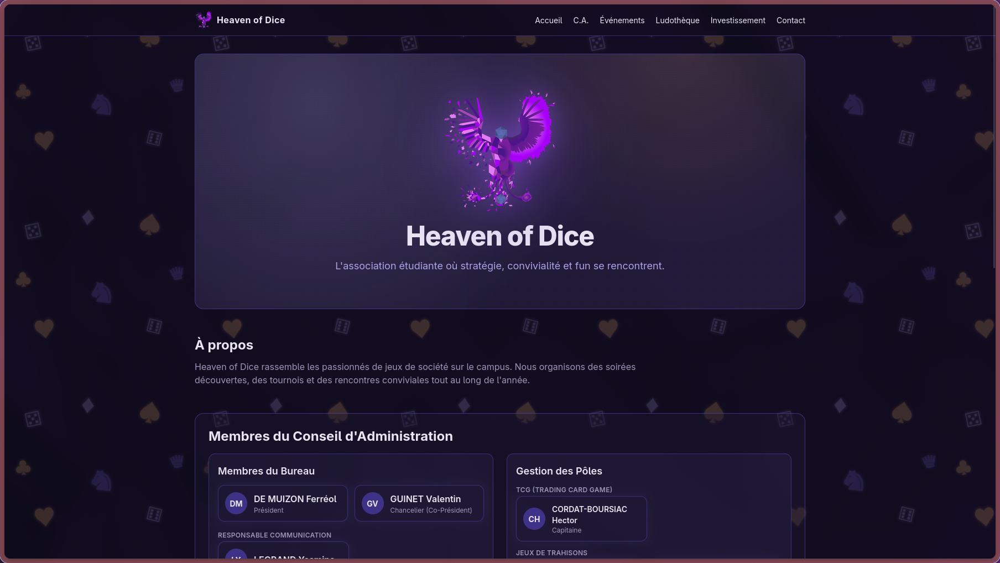
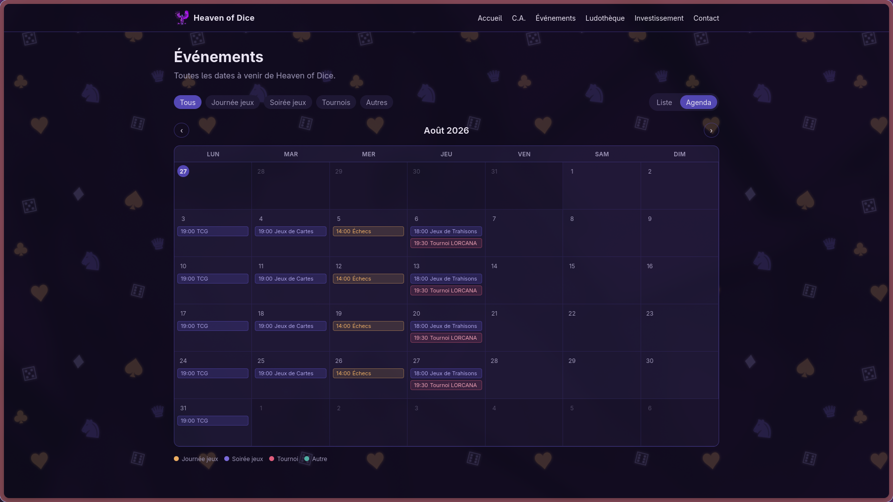
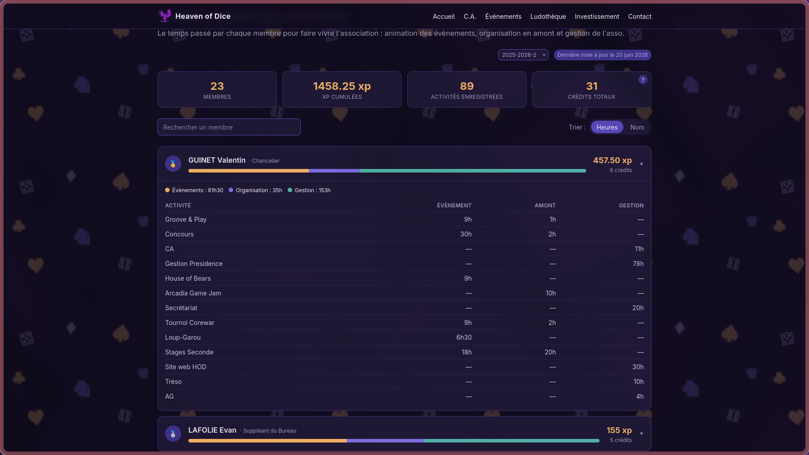

# HOD Showcase Site

Site officiel de l’association étudiante **Heaven of Dice (HOD)**, développé avec _Next.js, TypeScript et Tailwind CSS_.
Ce projet sert de vitrine pour l’association, ses activités, ses rapports de C.A., et ses actualités.

## Aperçu





## Lancer le projet en local

```bash
npm install
npm run dev
```

Le site sera accessible sur : http://localhost:3000

## Ajouter un rapport de C.A.

Pour publier un nouveau rapport :

1. Créer un fichier dans : `app/content/ca/`
2. Nommer le fichier selon le format : `yyyy-mm-dd-nom-du-rapport.md`
3. Ajouter le contenu en Markdown
4. Ouvrir une Pull Request

Une fois la PR fusionnée, le rapport apparaît sur le site dans les **5 minutes**.

## Contributions

Les contributions sont les bienvenues !
N’hésite pas à proposer des améliorations, corriger des rapports ou ajouter du contenu.
